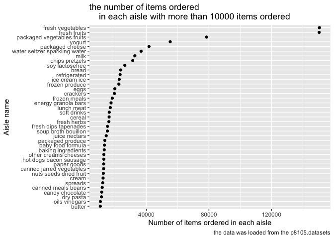
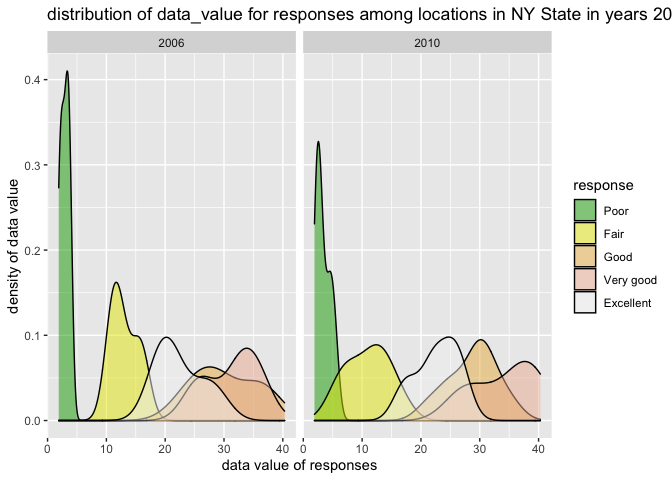

p8105\_hw3\_WZ2591
================
Wenyu Zhang
10/17/2021

``` r
library(tidyverse)
```

    ## ── Attaching packages ─────────────────────────────────────── tidyverse 1.3.1 ──

    ## ✓ ggplot2 3.3.5     ✓ purrr   0.3.4
    ## ✓ tibble  3.1.4     ✓ dplyr   1.0.7
    ## ✓ tidyr   1.1.3     ✓ stringr 1.4.0
    ## ✓ readr   2.0.1     ✓ forcats 0.5.1

    ## ── Conflicts ────────────────────────────────────────── tidyverse_conflicts() ──
    ## x dplyr::filter() masks stats::filter()
    ## x dplyr::lag()    masks stats::lag()

# Problem 1

load the data from the p8105.datasets

``` r
library(p8105.datasets)
data("instacart")
```

## Do some exploration of this dataset

Size of the data: The dataset contains 1384617 observations and 15
variables.

Structure of the data: The data is about the information of online
grocery orders from Instacart users. Each row represent one order of one
product from Instacart users. The dataset have 15 variables: order\_id,
product\_id, add\_to\_cart\_order, reordered, user\_id, eval\_set,
order\_number, order\_dow, order\_hour\_of\_day,
days\_since\_prior\_order, product\_name, aisle\_id, department\_id,
aisle, department and 4 character variables: eval\_set, product\_name,
aisle and department.

## Describing some key variables, and giving illstrative examples of observations

**1.** `reordered` record the product is been reordered or not.

The mean value of `reordered` is 0.5985944, and it means about 60%
products are reordered.

**2.** `order_hour_of_day`: records the time that the order was placed.

It shows most orders are placed at 14, which is at 2pm

**3.** `days_since_prior_order`: represents the time since the last
order.

The mean value of `days_since_prior_order` is 17.0661259, which means
people usually orders again after 17 days.

**4.** `product_name`: reprensets the name of product.

Banana is the product that users order most.

**illstrative examples of observations**

This is the data of the second row. It tells us that a users placed a
order of Organic 4% Milk Fat Whole Milk Cottage Cheese from other creams
cheeses aisle, which is 108 aisle from the department of dairy eggs. The
order was placed in 10 am Thursday, and it is 9 days since prior order.

``` r
instacart[2,] %>% knitr::kable()
```

| order\_id | product\_id | add\_to\_cart\_order | reordered | user\_id | eval\_set | order\_number | order\_dow | order\_hour\_of\_day | days\_since\_prior\_order | product\_name                                 | aisle\_id | department\_id | aisle                | department |
|----------:|------------:|---------------------:|----------:|---------:|:----------|--------------:|-----------:|---------------------:|--------------------------:|:----------------------------------------------|----------:|---------------:|:---------------------|:-----------|
|         1 |       11109 |                    2 |         1 |   112108 | train     |             4 |          4 |                   10 |                         9 | Organic 4% Milk Fat Whole Milk Cottage Cheese |       108 |             16 | other creams cheeses | dairy eggs |

## Answer the following (commenting on the results of each):

### 1. How many aisles are there, and which aisles are the most items ordered from?

There are 134 aisles and the most items are ordered form fresh
vegetables

``` r
length(unique(pull(instacart, aisle)))
names(sort(table(pull(instacart, aisle)),decreasing = TRUE))[1]
```

### 2. Make a plot that shows the number of items ordered in each aisle

``` r
aisle = 
  instacart %>% 
  count(aisle, name = 'number_of_items') %>%
  filter(number_of_items > 10000) %>% 
  ggplot(aes(reorder(aisle, number_of_items), x = number_of_items)) + 
  geom_point() + 
  labs(
    title = "the number of items ordered 
    in each aisle with more than 10000 items ordered",
    x = "Number of items ordered in each aisle",
    y = "Aisle name",
    caption = "the data was loaded from the p8105.datasets"
  )

aisle
```

<!-- -->

### 3. Make a table showing the three most popular items in each of the aisles “baking ingredients”, “dog food care”, and “packaged vegetables fruits”.

``` r
Three_pop_items = 
  instacart %>%
  group_by(aisle) %>%
  filter(aisle == "baking ingredients" | aisle == "dog food care" | aisle == "packaged vegetables fruits") %>%
  count(product_name, name = 'number_of_ordered_time') %>%
  top_n(n = 3, wt = number_of_ordered_time) %>% 
  arrange(desc(number_of_ordered_time)) %>%
  rename(
    'aisle name' = aisle, 
    'three most popular items in this aisle' = product_name, 
    'number of ordered time' = number_of_ordered_time
    ) %>% 
  knitr::kable(caption = "three most popular items 
               in each of the aisles baking ingredients, 
               dog food care, and packaged vegetables fruits")

Three_pop_items
```

| aisle name                 | three most popular items in this aisle        | number of ordered time |
|:---------------------------|:----------------------------------------------|-----------------------:|
| packaged vegetables fruits | Organic Baby Spinach                          |                   9784 |
| packaged vegetables fruits | Organic Raspberries                           |                   5546 |
| packaged vegetables fruits | Organic Blueberries                           |                   4966 |
| baking ingredients         | Light Brown Sugar                             |                    499 |
| baking ingredients         | Pure Baking Soda                              |                    387 |
| baking ingredients         | Cane Sugar                                    |                    336 |
| dog food care              | Snack Sticks Chicken & Rice Recipe Dog Treats |                     30 |
| dog food care              | Organix Chicken & Brown Rice Recipe           |                     28 |
| dog food care              | Small Dog Biscuits                            |                     26 |

three most popular items in each of the aisles baking ingredients, dog
food care, and packaged vegetables fruits

### 4. Make a table showing the mean hour of the day at which Pink Lady Apples and Coffee Ice Cream are ordered on each day of the week; format this table for human readers (i.e. produce a 2 x 7 table).

``` r
mean_hour_apples_icecream = 
  instacart %>%
  filter(product_name == "Pink Lady Apples" | product_name == "Coffee Ice Cream") %>% 
  select(order_dow, order_hour_of_day, product_name) %>%
  group_by(order_dow, product_name) %>%
  summarise(mean_hours_of_the_day = mean(order_hour_of_day)) %>%
  pivot_wider(names_from = 'order_dow',
              values_from = 'mean_hours_of_the_day'
              ) %>% 
  rename(`Sunday` = `0`, 
         `Monday` = `1`, 
         `Tuesday` = `2`, 
         `Wednesday` = `3`, 
         `Thursday` = `4`, 
         `Friday` = `5`, 
         `Saturday` = `6`) %>% 
  knitr::kable(caption = "the mean hour of the day 
               at which Pink Lady Apples 
               and Coffee Ice Cream are ordered on each day of the week")

mean_hour_apples_icecream
```

| product\_name    |   Sunday |   Monday |  Tuesday | Wednesday | Thursday |   Friday | Saturday |
|:-----------------|---------:|---------:|---------:|----------:|---------:|---------:|---------:|
| Coffee Ice Cream | 13.77419 | 14.31579 | 15.38095 |  15.31818 | 15.21739 | 12.26316 | 13.83333 |
| Pink Lady Apples | 13.44118 | 11.36000 | 11.70213 |  14.25000 | 11.55172 | 12.78431 | 11.93750 |

the mean hour of the day at which Pink Lady Apples and Coffee Ice Cream
are ordered on each day of the week

# Problem 2

load the data from the p8105.datasets

``` r
library(p8105.datasets)
data("brfss_smart2010")
```

## Clean the data

format the data to use appropriate variable names;

focus on the “Overall Health” topic

include only responses from “Excellent” to “Poor”

organize responses as a factor taking levels ordered from “Poor” to
“Excellent”

``` r
brfss_clean =
  brfss_smart2010 %>%
  janitor::clean_names() %>%
  select(-locationabbr) %>% 
  separate(locationdesc, into = c("state", "county"), sep = " - ") %>% 
  filter(topic == 'Overall Health') %>%
  filter(response == "Excellent" | response == "Very good" | response == "Good" | response == "Fair" | response == "Poor"
         ) %>% 
  mutate(response = factor(response, levels = c('Poor', 
                                                'Fair', 
                                                'Good', 
                                                'Very good', 
                                                'Excellent'), 
                           ordered = TRUE)) %>% 
  arrange(response)


brfss_clean
```

    ## # A tibble: 10,625 × 23
    ##     year state county   class  topic  question   response sample_size data_value
    ##    <int> <chr> <chr>    <chr>  <chr>  <chr>      <ord>          <int>      <dbl>
    ##  1  2010 AL    Jeffers… Healt… Overa… How is yo… Poor              45        5.5
    ##  2  2010 AL    Mobile … Healt… Overa… How is yo… Poor              66        6.4
    ##  3  2010 AL    Tuscalo… Healt… Overa… How is yo… Poor              35        4.2
    ##  4  2010 AZ    Maricop… Healt… Overa… How is yo… Poor              62        3.5
    ##  5  2010 AZ    Pima Co… Healt… Overa… How is yo… Poor              49        5.7
    ##  6  2010 AZ    Pinal C… Healt… Overa… How is yo… Poor              30        4  
    ##  7  2010 AR    Benton … Healt… Overa… How is yo… Poor              21        3  
    ##  8  2010 AR    Pulaski… Healt… Overa… How is yo… Poor              36        3.8
    ##  9  2010 AR    Washing… Healt… Overa… How is yo… Poor              16        2.4
    ## 10  2010 CA    Alameda… Healt… Overa… How is yo… Poor              23        2.4
    ## # … with 10,615 more rows, and 14 more variables: confidence_limit_low <dbl>,
    ## #   confidence_limit_high <dbl>, display_order <int>, data_value_unit <chr>,
    ## #   data_value_type <chr>, data_value_footnote_symbol <chr>,
    ## #   data_value_footnote <chr>, data_source <chr>, class_id <chr>,
    ## #   topic_id <chr>, location_id <chr>, question_id <chr>, respid <chr>,
    ## #   geo_location <chr>

## Answer the following questions:

### 1. In 2002, which states were observed at 7 or more locations? What about in 2010?

``` r
locations_2002_2010 = 
  brfss_clean %>% 
  filter(year == 2002 | year == 2010) %>% 
  group_by(state, year) %>% 
  summarise(observed = n_distinct(county)) %>% 
  filter(observed >= 7) %>%
  pivot_wider(
    names_from = state,
    values_from = observed) %>% 
  knitr::kable()

locations_2002_2010
```

| year |  CA |  CO |  CT |  FL |  MA |  MD |  NC |  NE |  NJ |  NY |  OH |  PA |  SC |  TX |  WA |
|-----:|----:|----:|----:|----:|----:|----:|----:|----:|----:|----:|----:|----:|----:|----:|----:|
| 2010 |  12 |   7 |  NA |  41 |   9 |  12 |  12 |  10 |  19 |   9 |   8 |   7 |   7 |  16 |  10 |
| 2002 |  NA |  NA |   7 |   7 |   8 |  NA |   7 |  NA |   8 |  NA |  NA |  10 |  NA |  NA |  NA |

### 2. Construct a dataset that is limited to Excellent responses, and contains, year, state, and a variable that averages the data\_value across locations within a state. Make a “spaghetti” plot of this average value over time within a state

``` r
excellent_response = 
  brfss_clean %>% 
  filter(response == "Excellent") %>%
  select(year, state, data_value) %>% 
  group_by(year, state) %>% 
  summarise(average_data_value = mean(data_value))

excellent_response
```

    ## # A tibble: 443 × 3
    ## # Groups:   year [9]
    ##     year state average_data_value
    ##    <int> <chr>              <dbl>
    ##  1  2002 AK                  27.9
    ##  2  2002 AL                  18.5
    ##  3  2002 AR                  24.1
    ##  4  2002 AZ                  24.1
    ##  5  2002 CA                  22.7
    ##  6  2002 CO                  23.1
    ##  7  2002 CT                  29.1
    ##  8  2002 DC                  29.3
    ##  9  2002 DE                  20.9
    ## 10  2002 FL                  25.7
    ## # … with 433 more rows

``` r
excellent_response_plot = 
  excellent_response %>% 
  ggplot(aes(x = year, y = average_data_value, color = state)) +
  geom_line() +
  labs(
    title = "the average value over time within a state",
    caption = "Data from brfss_smart2010")

excellent_response_plot
```

    ## Warning: Removed 3 row(s) containing missing values (geom_path).

<!-- -->

### 3. Make a two-panel plot showing, for the years 2006, and 2010, distribution of data\_value for responses (“Poor” to “Excellent”) among locations in NY State.

``` r
distribution = 
  brfss_clean %>% 
  filter(year == 2006 | year == 2010,
         state == 'NY') %>%
  select(year, state, county, response, data_value) 
```

``` r
distribution_plot = 
  distribution %>%
  ggplot(aes(x = data_value, fill = response)) +
  geom_density() +
  facet_grid(. ~ year) +
  labs(title = "distribution of data_value for responses among locations in NY State in years 2006, and 2010",
       x = "data value of responses",
       y = "density of data value") +
  scale_fill_manual(values = alpha(terrain.colors(5), 0.5))

distribution_plot
```

<!-- -->

# Problem 3

## Load, tidy, and otherwise wrangle the data.

``` r
accel_data = 
  read_csv("data/accel_data.csv") %>% 
  janitor::clean_names() %>% 
  mutate(
    weekday_or_weekend = case_when(
      day == "Monday" ~ "weekday",
      day == "Tuesday" ~ "weekday",
      day == "Wednesday" ~ "weekday",
      day == "Thursday" ~ "weekday",
      day == "Friday" ~ "weekday",
      day == "Saturday" ~ "weekend",
      day == "Sunday" ~ "weekend")
  ) %>% 
  mutate(day = factor(day, levels = 
                        c("Monday", 
                          "Tuesday", 
                          "Wednesday", 
                          "Thursday", 
                          "Friday", 
                          "Saturday",  
                          "Sunday"))) %>% 
  select(day_id, day, weekday_or_weekend, week, everything()) %>% 
  pivot_longer(activity_1:activity_1440,
    names_to = "activity_minutes",
    names_prefix = "activity_",
    values_to = "activity_counts") %>% 
  mutate(
    week = as.factor(week), 
    weekday_or_weekend = as.factor(weekday_or_weekend),
    activity_minutes = as.numeric(activity_minutes)
  ) %>% 
  arrange(week)
```

    ## Rows: 35 Columns: 1443

    ## ── Column specification ────────────────────────────────────────────────────────
    ## Delimiter: ","
    ## chr    (1): day
    ## dbl (1442): week, day_id, activity.1, activity.2, activity.3, activity.4, ac...

    ## 
    ## ℹ Use `spec()` to retrieve the full column specification for this data.
    ## ℹ Specify the column types or set `show_col_types = FALSE` to quiet this message.

``` r
accel_data    
```

    ## # A tibble: 50,400 × 6
    ##    day_id day    weekday_or_weekend week  activity_minutes activity_counts
    ##     <dbl> <fct>  <fct>              <fct>            <dbl>           <dbl>
    ##  1      1 Friday weekday            1                    1            88.4
    ##  2      1 Friday weekday            1                    2            82.2
    ##  3      1 Friday weekday            1                    3            64.4
    ##  4      1 Friday weekday            1                    4            70.0
    ##  5      1 Friday weekday            1                    5            75.0
    ##  6      1 Friday weekday            1                    6            66.3
    ##  7      1 Friday weekday            1                    7            53.8
    ##  8      1 Friday weekday            1                    8            47.8
    ##  9      1 Friday weekday            1                    9            55.5
    ## 10      1 Friday weekday            1                   10            43.0
    ## # … with 50,390 more rows

## Describe the resulting dataset

The dataset contains 50400 observations and 6 variables.The variables
are day\_id, day, weekday\_or\_weekend, week, activity\_minutes,
activity\_counts

`week`: to see which week of accelerometer data was collected on a
63-year-old male with BMI of 25

`day_id`: day identifier

`day`: to see which day that the data collected in the week

`weekday_weekend`: to see the day is whether weekday or weekend

`activity_minutes`: count for each minute of a 24-hour day starting at
midnight

`acitvity_counts`: accelerometer value in each activity\_minutes

## Traditional analyses of accelerometer data focus on the total activity over the day.

``` r
accel_data_analysis =
  accel_data %>% 
  group_by(week, day) %>% 
  summarise(total_activity = sum(activity_counts)) %>% 
   pivot_wider(
  names_from = "day", 
  values_from = "total_activity") %>%
  knitr::kable(caption = "A total activity counts for each day in 5 week")
```

    ## `summarise()` has grouped output by 'week'. You can override using the `.groups` argument.

``` r
accel_data_analysis
```

| week |    Monday |  Tuesday | Wednesday | Thursday |   Friday | Saturday | Sunday |
|:-----|----------:|---------:|----------:|---------:|---------:|---------:|-------:|
| 1    |  78828.07 | 307094.2 |    340115 | 355923.6 | 480542.6 |   376254 | 631105 |
| 2    | 295431.00 | 423245.0 |    440962 | 474048.0 | 568839.0 |   607175 | 422018 |
| 3    | 685910.00 | 381507.0 |    468869 | 371230.0 | 467420.0 |   382928 | 467052 |
| 4    | 409450.00 | 319568.0 |    434460 | 340291.0 | 154049.0 |     1440 | 260617 |
| 5    | 389080.00 | 367824.0 |    445366 | 549658.0 | 620860.0 |     1440 | 138421 |

A total activity counts for each day in 5 week

**Are any trends apparent?** Normally, the accelerometer value in
weekend is lower than the value in weekday. In saturdays of week 4 and
week 5, the accelerometer value is only 1440, this is probability
because patients forget to wear the accelerometer.

## Make a single-panel plot that shows the 24-hour activity time courses for each day and use color to indicate day of the week.

``` r
activity_time_plot = 
  accel_data %>% 
  ggplot(aes(
         x = activity_minutes / 60,
         y = activity_counts,
         color = day)) +
  geom_line(aes(color = day)) +
  labs(title = "the 24-hour activity time courses for each day", 
       x = "24-hour activity time", 
       y = "activity value",
       caption = "Data from accel_data.csv") +
  scale_x_continuous(
    breaks = c(0, 3, 6, 9, 12, 15, 18, 21, 24), 
    labels = c("00:00", 
               "03:00", 
               "06:00", 
               "09:00", 
               "12:00", 
               "15:00", 
               "18:00", 
               "21:00", 
               "24:00"), 
    limits = c(0, 24)) +
  scale_color_hue(name = "Day of week")

activity_time_plot
```

<!-- -->

We can see from the plot, the peak of activity for this male is around
12:00 and 19:30 - 21:00.
