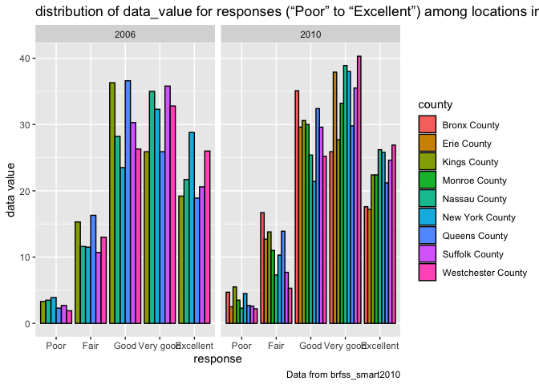

p8105\_hw2\_WZ2591
================
Wenyu Zhang
10/17/2021

``` r
library(tidyverse)
```

    ## ── Attaching packages ─────────────────────────────────────── tidyverse 1.3.1 ──

    ## ✓ ggplot2 3.3.5     ✓ purrr   0.3.4
    ## ✓ tibble  3.1.4     ✓ dplyr   1.0.7
    ## ✓ tidyr   1.1.3     ✓ stringr 1.4.0
    ## ✓ readr   2.0.1     ✓ forcats 0.5.1

    ## ── Conflicts ────────────────────────────────────────── tidyverse_conflicts() ──
    ## x dplyr::filter() masks stats::filter()
    ## x dplyr::lag()    masks stats::lag()

# Problem 1

load the data from the p8105.datasets

``` r
library(p8105.datasets)
data("instacart")
```

## Do some exploration of this dataset

Size of the data: The dataset contains 1384617 observations and 15
variables.

Structure of the data: The data is about the information of online
grocery orders from Instacart users. Each row represent one order of one
product from Instacart users. The dataset have 15 variables: eval\_set,
product\_name, aisle, department, order\_id, product\_id,
add\_to\_cart\_order, reordered, user\_id, order\_number, order\_dow,
order\_hour\_of\_day, days\_since\_prior\_order, aisle\_id and
department\_id.

## Describing some key variables, and giving illstrative examples of observations

### 1. The mean of variable `reordered` is 0.5985944, and it means about 60% products are reordered.

``` r
mean(pull(instacart, reordered))
```

    ## [1] 0.5985944

### 2. The variable `order_hour_of_day` menas the time that the order was placed, and it shows most orders are placed at 14, which is at 2pm

``` r
names(sort(table(pull(instacart, order_hour_of_day)),decreasing=TRUE))[1]
```

    ## [1] "14"

### 3. The mean value of `days_since_prior_order` is 17.0661259, which means people usually orders again after 17 days. And most of people order after 30 days from the prior order

``` r
mean(pull(instacart, days_since_prior_order))
```

    ## [1] 17.06613

``` r
names(sort(table(pull(instacart, days_since_prior_order)),decreasing=TRUE))[1]
```

    ## [1] "30"

### 4. This means Banana is the product that users order most.

``` r
names(sort(table(pull(instacart, product_name)),decreasing=TRUE))[1]
```

    ## [1] "Banana"

### This is the data of the second row. It tells us that a users placed a order of Organic 4% Milk Fat Whole Milk Cottage Cheese from other creams cheeses aisle, which is 108 aisle from the department of dairy eggs. The order was placed in 10 am Thursday, and it is 9 days since prior order.

``` r
instacart[2,] %>% knitr::kable()
```

| order\_id | product\_id | add\_to\_cart\_order | reordered | user\_id | eval\_set | order\_number | order\_dow | order\_hour\_of\_day | days\_since\_prior\_order | product\_name                                 | aisle\_id | department\_id | aisle                | department |
|----------:|------------:|---------------------:|----------:|---------:|:----------|--------------:|-----------:|---------------------:|--------------------------:|:----------------------------------------------|----------:|---------------:|:---------------------|:-----------|
|         1 |       11109 |                    2 |         1 |   112108 | train     |             4 |          4 |                   10 |                         9 | Organic 4% Milk Fat Whole Milk Cottage Cheese |       108 |             16 | other creams cheeses | dairy eggs |

## Answer the following (commenting on the results of each):

### How many aisles are there, and which aisles are the most items ordered from?

There are 134 aisles and the most items are ordered form fresh
vegetables

``` r
length(unique(pull(instacart, aisle)))
names(sort(table(pull(instacart, aisle)),decreasing=TRUE))[1]
```

### Make a plot that shows the number of items ordered in each aisle

``` r
aisle = 
  instacart %>% 
  count(aisle, name = 'number_of_items') %>%
  filter(number_of_items > 10000) %>% 
  ggplot(aes(reorder(aisle, number_of_items), x = number_of_items)) + 
  geom_point() + 
  labs(
    title = "the number of items ordered in each aisle with more than 10000 items ordered",
    x = "Number of items ordered in each aisle",
    y = "Aisle name",
    caption = "the data was loaded from the p8105.datasets"
  )

aisle
```

<!-- -->

### Make a table showing the three most popular items in each of the aisles “baking ingredients”, “dog food care”, and “packaged vegetables fruits”.

``` r
Three_pop_items = 
  instacart %>%
  group_by(aisle) %>%
  filter(aisle == "baking ingredients" | aisle == "dog food care" | aisle == "packaged vegetables fruits") %>% 
  count(product_name, name = 'number_of_ordered_time') %>%
  top_n(n = 3, wt = number_of_ordered_time) %>% 
  arrange(desc(number_of_ordered_time)) %>%
  rename(
    'aisle name' = aisle, 
    'three most popular items in this aisle' = product_name, 
    'number of ordered time' = number_of_ordered_time
    ) %>% 
  knitr::kable()

Three_pop_items
```

| aisle name                 | three most popular items in this aisle        | number of ordered time |
|:---------------------------|:----------------------------------------------|-----------------------:|
| packaged vegetables fruits | Organic Baby Spinach                          |                   9784 |
| packaged vegetables fruits | Organic Raspberries                           |                   5546 |
| packaged vegetables fruits | Organic Blueberries                           |                   4966 |
| baking ingredients         | Light Brown Sugar                             |                    499 |
| baking ingredients         | Pure Baking Soda                              |                    387 |
| baking ingredients         | Cane Sugar                                    |                    336 |
| dog food care              | Snack Sticks Chicken & Rice Recipe Dog Treats |                     30 |
| dog food care              | Organix Chicken & Brown Rice Recipe           |                     28 |
| dog food care              | Small Dog Biscuits                            |                     26 |

### Make a table showing the mean hour of the day at which Pink Lady Apples and Coffee Ice Cream are ordered on each day of the week; format this table for human readers (i.e. produce a 2 x 7 table).

``` r
mean_hour_apples_icecream = 
  instacart %>%
  filter(product_name == "Pink Lady Apples" | product_name == "Coffee Ice Cream") %>% 
  select(order_dow, order_hour_of_day, product_name) %>%
  group_by(order_dow, product_name) %>%
  summarise(mean_hours_of_the_day = mean(order_hour_of_day)) %>%
  pivot_wider(names_from = 'order_dow',
              values_from = 'mean_hours_of_the_day'
              ) %>% 
  rename(`Sunday` = `0`, 
         `Monday` = `1`, 
         `Tuesday` = `2`, 
         `Wednesday` = `3`, 
         `Thursday` = `4`, 
         `Friday` = `5`, 
         `Saturday` = `6`) %>% 
  knitr::kable()
```

    ## `summarise()` has grouped output by 'order_dow'. You can override using the `.groups` argument.

``` r
mean_hour_apples_icecream
```

| product\_name    |   Sunday |   Monday |  Tuesday | Wednesday | Thursday |   Friday | Saturday |
|:-----------------|---------:|---------:|---------:|----------:|---------:|---------:|---------:|
| Coffee Ice Cream | 13.77419 | 14.31579 | 15.38095 |  15.31818 | 15.21739 | 12.26316 | 13.83333 |
| Pink Lady Apples | 13.44118 | 11.36000 | 11.70213 |  14.25000 | 11.55172 | 12.78431 | 11.93750 |

# Problem 2

load the data from the p8105.datasets

``` r
library(p8105.datasets)
data("brfss_smart2010")
```

## Clean the data

``` r
brfss_clean =
  brfss_smart2010 %>%
  janitor::clean_names() %>%
  select(-locationabbr) %>% 
  separate(locationdesc, into = c("state", "county"), sep = " - ") %>% 
  filter(topic == 'Overall Health',
         response %in% c('Poor', 'Fair', 'Good', 'Very good', 'Excellent')) %>%
  mutate(response = factor(response, levels = c('Poor', 'Fair', 'Good', 'Very good', 'Excellent'), ordered = TRUE)) %>% 
  arrange(response)


brfss_clean
```

    ## # A tibble: 10,625 × 23
    ##     year state county   class  topic  question   response sample_size data_value
    ##    <int> <chr> <chr>    <chr>  <chr>  <chr>      <ord>          <int>      <dbl>
    ##  1  2010 AL    Jeffers… Healt… Overa… How is yo… Poor              45        5.5
    ##  2  2010 AL    Mobile … Healt… Overa… How is yo… Poor              66        6.4
    ##  3  2010 AL    Tuscalo… Healt… Overa… How is yo… Poor              35        4.2
    ##  4  2010 AZ    Maricop… Healt… Overa… How is yo… Poor              62        3.5
    ##  5  2010 AZ    Pima Co… Healt… Overa… How is yo… Poor              49        5.7
    ##  6  2010 AZ    Pinal C… Healt… Overa… How is yo… Poor              30        4  
    ##  7  2010 AR    Benton … Healt… Overa… How is yo… Poor              21        3  
    ##  8  2010 AR    Pulaski… Healt… Overa… How is yo… Poor              36        3.8
    ##  9  2010 AR    Washing… Healt… Overa… How is yo… Poor              16        2.4
    ## 10  2010 CA    Alameda… Healt… Overa… How is yo… Poor              23        2.4
    ## # … with 10,615 more rows, and 14 more variables: confidence_limit_low <dbl>,
    ## #   confidence_limit_high <dbl>, display_order <int>, data_value_unit <chr>,
    ## #   data_value_type <chr>, data_value_footnote_symbol <chr>,
    ## #   data_value_footnote <chr>, data_source <chr>, class_id <chr>,
    ## #   topic_id <chr>, location_id <chr>, question_id <chr>, respid <chr>,
    ## #   geo_location <chr>

## Answer the following questions:

### 1. In 2002, which states were observed at 7 or more locations? What about in 2010?

``` r
locations_2002_2010 = 
  brfss_clean %>% 
  filter(year == 2002 | year == 2010) %>% 
  group_by(state, year) %>% 
  summarise(observed = n_distinct(county)) %>% 
  filter(observed >= 7) %>%
  pivot_wider(
    names_from = year,
    values_from = observed) 

locations_2002_2010
```

    ## # A tibble: 15 × 3
    ## # Groups:   state [15]
    ##    state `2010` `2002`
    ##    <chr>  <int>  <int>
    ##  1 CA        12     NA
    ##  2 CO         7     NA
    ##  3 CT        NA      7
    ##  4 FL        41      7
    ##  5 MA         9      8
    ##  6 MD        12     NA
    ##  7 NC        12      7
    ##  8 NE        10     NA
    ##  9 NJ        19      8
    ## 10 NY         9     NA
    ## 11 OH         8     NA
    ## 12 PA         7     10
    ## 13 SC         7     NA
    ## 14 TX        16     NA
    ## 15 WA        10     NA

## 2. Construct a dataset that is limited to Excellent responses, and contains, year, state, and a variable that averages the data\_value across locations within a state. Make a “spaghetti” plot of this average value over time within a state

``` r
excellent_response = 
  brfss_clean %>% 
  filter(response == "Excellent") %>%
  select(year, state, data_value) %>% 
  group_by(year, state) %>% 
  summarise(average_data_value = mean(data_value))
```

    ## `summarise()` has grouped output by 'year'. You can override using the `.groups` argument.

``` r
excellent_response
```

    ## # A tibble: 443 × 3
    ## # Groups:   year [9]
    ##     year state average_data_value
    ##    <int> <chr>              <dbl>
    ##  1  2002 AK                  27.9
    ##  2  2002 AL                  18.5
    ##  3  2002 AR                  24.1
    ##  4  2002 AZ                  24.1
    ##  5  2002 CA                  22.7
    ##  6  2002 CO                  23.1
    ##  7  2002 CT                  29.1
    ##  8  2002 DC                  29.3
    ##  9  2002 DE                  20.9
    ## 10  2002 FL                  25.7
    ## # … with 433 more rows

``` r
excellent_response_plot = 
  excellent_response %>% 
  ggplot(aes(x = year, y = average_data_value, color = state)) +
  geom_line() +
  labs(
    title = "the average value over time within a state",
    caption = "Data from brfss_smart2010")

excellent_response_plot
```

    ## Warning: Removed 3 row(s) containing missing values (geom_path).

<!-- -->

## 3. Make a two-panel plot showing, for the years 2006, and 2010, distribution of data\_value for responses (“Poor” to “Excellent”) among locations in NY State.

``` r
distribution_plot = 
  brfss_clean %>% 
  filter(year == 2006 | year == 2010,
         state == 'NY') %>%
  select(year, state, county, response, data_value) %>%
  ggplot(aes(x = response,y = data_value, fill = county)) +
  geom_col(position = "dodge",colour = "black") +
  facet_grid(.~year) +
  labs(
    title = "distribution of data_value for responses (“Poor” to “Excellent”) among locations in NY State in years 2006, and 2010",
    x = "response",
    y = "data value",
    caption = "Data from brfss_smart2010")

distribution_plot
```

<!-- -->
